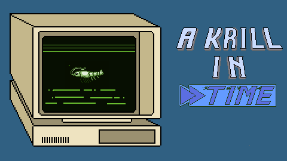
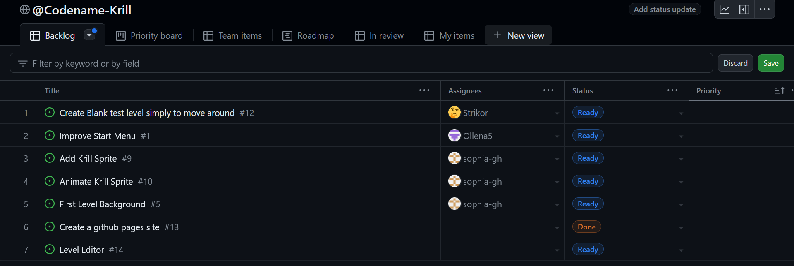

### Product Proposal

**1. Title Page**  
   **"A Krill In Time"** 
   
      Title Screen(WIP)

   > Proposed By: Anna Anello, Sophia Testa, Jason Graham, Mason Shreffler, Alyssa reinagle, Chuck, Erik wood, Emmanuel David, Mohammad Alashkar, Nolan 
   >
   > Febuary 12, 2024
   
_________________

**2. Executive Summary**

   > You are a Krill. You can manipulate time. You must use this power to enact your goal: *escape*. In "A Krill in Time," time is your enemy, your friend, and your weapon. This top-down, 2D, stealth, survival game, allows players to control a krill who manipulates time. With this power players must solve puzzles and clear levels in order to escape a high-security animal testing facility. Survival is achived, not by fighting enemies, but evading them through time manipulation, and ultimately escaping the lab. 
   
_________________

**3. Product Vision**  
   >**Purpose of the Product**: This immersive stealth game, challenges players to navigate through complex environments filled with dynamic, semi-intelligent NPCs and inticate puzzles. Strategic thinking is required as players assume the role of a krill equipped with a temporal manipualtion capability. This mechanic is deeply woven into the game's puzzle design, and level progession systems. While solving these puzzles the player must also avoid detection and confrontation with enemies. In order to complete the mission of escaping, a blend of tactical foresight, spatial awareness, and stategic use of the time manipulation mechanic are required. All of this will be presented as a sleek online browser game with keyboard controls.     
   >  
   >**Target Audience**: The aim for this project is to create an experience that is accessible for those who are newer to browser gaming while also having features that appeal to more skilled players.   
   > 
   >**Long-term Vision**: A polished, completed game that is hosted and playable on a browser. The scope of this game is mainly to showcase the growth in software development skills of the team making it. But outside of this class we also intend to produce a product that we are proud of and is fun to play. 
_________________

**4. Product Value**
   > **Benefits**: The main benefits of this project go to the software development team working on it. By the completion of "A Krill In Time," team members will have gained the lifelong skills of proper software development practices, working well on a team, and better use of important tools like GitHub. The other benefactors will, ofcourse, be the players who get to play an enteraining and interesting finished product.    
   > **Cost Analysis**: The creation of this project will require several months worth of time and effort from the development team. This includes man hours devoted to coding, revising, documenting, and designing for all aspects of the game.  
   > **Value Proposition**: The benefits of this game come primarily from the action of creating the game. As stated previously the development team gains knowledge of software development, and players gain the benefit of playing an interesting final product. These benefits exceed the costs, which simply amount to man hours.  

**5. Product Creation Outline**
   > **Design Overview**: This game will be a top-down, 2D, pixelart game. The plan is to include the following features (an more):
      > - multiple complex levels where the solution/direction to levels is not immediately obvious
      > - Environmentally based puzzles/environment interaction
      > - time manipulation as a primary gameplay mechanic
      > - Dynamic semi-intelligent NPC behavior
      > - multiple difficulty levels for players of different skill levels 
      > 
   > **Development Plan**: No set plan with milestones created yet, but in order to complete the task of creating this product, the development team will have weekly meetings with discussions of the goals for each sprint, as well as the overarching goals of the project as a whole.   
   > **Development Methodology**: Our team will be using th engineering methodology of Scrum sprints with Kanban. All the requirements for each sprint will be added to that sprint's kanban from the project issues backlog, during each sprint(sprint period: roughly 1 week) issues will be worked on and tested.   
   > **Resource Requirements**: The resources and technologies our team plans on using are:
      > - HTML / CSS
      > - Javascript
      > - Github
      > - Discord
      > - GitKraken
      > - VSCode
      > - GitHub pages
      > - P5.js

**6. Quality and Evaluation**
   > **Quality Standards**: Original artwork and assets that look good, well functioning and tested code, thoughful level design, interesting gameplay, useful mechanics  
   > **Testing Procedures**: Our team will discuss futher how we wish to implement testing, as of now the plan is to test incrementakky using standard JavaScript testing idioms   
   > **Evaluation Metrics**: Later on as more of the objective are implemented, play testing can be considered.

**7. Deployment Plans**
   > **Automation and Mechanisms**: The end produc wil be a web based game hosted through using GitHub tools on a school affilated site.
   > **Production Timeline**: While it is too early to outline milestones in development, the planned released of the finished product coincides with the final examination date for this course.  
   > **User Training**: A tutorial level will be provided for new players.   
   > **Risk Management**: Writing secure code that can be hosted on a server without causing any issues is our main concern.  

**8. Maintenance Plans**
   > **Defects:**  More rigorous testing will be done if a defect is discovered post-release  
   > **Evolution:**  After release the development team has no current plans to maintain the product

**Sprint One Kanban Backlog:**
   > As planned the team will move forward with sprint one from:   
   Monday Febuary 12 - Monday Febuary 19

   